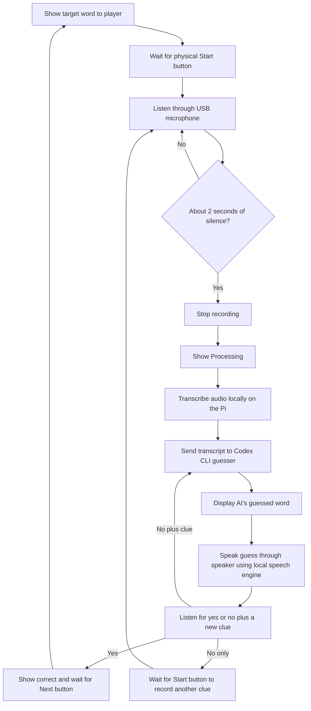

# Chatterboxes

Jonathan Tumalle (jrt285)
Ani Hadagali (ah2495)

# Part 1

## A. Text to Speech

[link to script](speech-scripts/text_to_speech_a.sh)

*Answer:* I used three different voices for the script. The voices changed in how formal and inviting they sounded. `en_US-norman-medium` sounds more friendly like an actual greeting. `en_GB-vctk-medium` sounds very monotone and disinterested. `en_GB-southern_english_female-low` was just formal and direct.

## B. Speech to Text

The real time factor of the two models I chose:

- small - 1.30x
- tiny - 0.22x

Accuracy improvements stop being worth the delay if the text already captures the words said with tolerance for some grammatical errors. In the example, the output of the `small` was "Hey, this is Jonathan. I hope you're having a great day." The `tiny` transcribed the same audio to "Hey this is Jonathan, I hope you're having a great day." This grammar inaccuracy is fine for me as the reader since I can understand the intention still. If this was to be sent to someone else in a more formal setting, then I may prefer the `small`'s output since I would have less tolerance for grammar mistakes.

Script is [here](speech-scripts/transcribe_numbers.py)

## C. Turn-taking: knowing when someone has stopped talking

*Answer:* A larger delay makes the system feel like it's trying to actually log what was said and comprehend it, while the smaller delay feels rushed. The smaller delay makes it feel like the model is not understanding, and the text output also showed this behavior. It was as if it was cutting me off like a rude person.

## D. Storyboard

### IDEA: 2 player Taboo (WordHound)

Storyboard:

Verplank diagram:

#### WordHound dialogue script

WordHound is a two-player Taboo game in which the device guesses the secret word from one player's spoken clues. The clue-giver sees the card; WordHound must not. Each player gets an 2 minute turn as the clue-giver. A correct guess earns the clue-giver one point and advances to the next card. A wrong guess keeps the same card active so the player can add a clue. The player with the most points after both turns wins.

##### Example round [AI Assisted in setting up the script]

**Word on card (Freddy only):** moth 
**Taboo words:** insect, wings, butterfly, light

**WordHound:** Freddy, your turn. Your 2 minutes start now. Describe the word without saying the word or the words printed on the card.

*[Pause for Freddy to begin; allow up to 5 seconds. If no speech is detected, prompt once: "I'm listening for your clue."]*

**Freddy:** It comes out at night and flies around a porch lamp.

*[Wait for Freddy to finish. Treat 1.0 second of silence as the end of the clue; if speech resumes before then, keep listening.]*

**WordHound:** Is it a butterfly?

**Freddy:** No, similar, but it's attracted to light.

*[Wait for the end of the reply using the same 1.0-second silence threshold.]*

**WordHound:** Is it a moth?

**Freddy:** Yes!

**WordHound:** Correct! Freddy gets one point. Your score is one. Here's the next word.

*[Brief 1-second pause while WordHound selects the next card, then continue listening.]*

**WordHound:** Here's your next word.

*[Brief 1-second pause for the next card. WordHound listens for Freddy's clue and waits for 1.0 second of silence before guessing.]*

**Freddy:** It flies at night and hangs upside down in a cave.

**WordHound:** Is it a bat?

**Freddy:** Yes!

**WordHound:** Correct! That's two points for Freddy.

*[Timer runs out]*

**WordHound:** Your turn is over. *[Pause 2 seconds while the device switches players.]* Sam, your turn. Your 2 minutes start now. Describe the word on your card without saying the word or the words printed on it.

*[Sam looks at the card. WordHound waits up to 5 seconds for Sam to begin; if no speech is detected, it prompts once: "I'm listening for your clue."]*

**Sam:** You use it to unlock a door. It can be metal, and you might keep it on a ring.

*[WordHound waits for the clue to end, using 1.0 second of silence.]*

**WordHound:** Is it a key?

**Sam:** Yes!

**WordHound:** Correct! Sam gets one point. *[Pause 1 second to select the next card.]* Here's your next word.

**Sam:** You wear it on your wrist and it tells you the time.

*[WordHound waits for 1.0 second of silence.]*

**WordHound:** Is it a watch?

**Sam:** Yes!

**WordHound:** Correct! That's two points. *[Pause 1 second to select the next card.]* Here's your next word.

**Sam:** It is a place where you borrow books.

*[WordHound waits for 1.0 second of silence.]*

**WordHound:** Is it a library?

**Sam:** Yes!

**WordHound:** Correct! That's three points.

*[The 2-minute timer ends.]*

**WordHound:** Time! Sam scored three points this turn. This round ends with Freddy at two points and Sam at three.

*[Skip ahead through the remaining rounds. WordHound keeps score and alternates turns.]*

**WordHound:** Game over! Freddy finished with eight points, and Sam finished with ten. Sam wins!

## E. Acting out the dialogue

*Answer:* We described our feedback as part of the video.

[Watch the video here](https://drive.google.com/file/d/1XunK0EcWV18VXaPGtrj4vkQcQwvqhCNR/view?usp=share_link)

# Lab 3 Part 2

### WordHound POC: One-Player Word Guessing Game

WordHound is a one-player prototype where he player sees a target
word on the screen and describes it aloud while WordHound tries to infer
the word. This POC is not a competitive two-player Taboo game: it has no
forbidden words, turn-taking between players, timer, or score. The target
word remains visible to the player, but it is never sent to the transcription
or guessing systems.

The player presses a button to start a clue. After roughly two seconds
of silence, WordHound saves the recording,transcribes it locally on the Pi,
and asks an AI model to make a guess from the transcript. It shows and speaks
the guess. The player then says "yes" to complete the card, or says "no" followed
by another clue. A no-with-clue is immediately combined with the earlier clue
and guess to make another guess. Once the player confirms a guess, there's a button
to advance to the next card.

Go [here](./wordhound/README.md) to see how to run it. All source code is in the 
[wordhound](./wordhound/) directory.

#### POC components

- **Raspberry Pi app and Mini PiTFT:** shows the target word to the player,
  the current listening/processing state, the transcript, and the AI's guess.
- **Physical controls:** the buttons start a clue (or a replacement clue)
  or advance to another word after a correct guess.
- **USB microphone:** captures the clue giver's speech. stops recording after
  about two seconds of silence and provides audible start/end cues.
- **Local speech recognition:** faster-whisper transcribes each recorded clue
  and feedback response on the Pi.
- **Codex CLI guesser:** receives only clue transcripts and returns a guessed
  word; it cannot access the target word or card list.
- **USB speaker and local speech engine:** announce the AI's guess aloud using
  piper's text-to-speech engine.
- **Feedback listener:** treats a spoken "yes" as completion, or uses the
  clue after a spoken "no" for the next guess without another recording turn.

## Test the system

[Video of the WordHound test](https://drive.google.com/file/d/1_pz2qFzLvdmUcKt7rhRDiMKAIYdDDjXC/view?usp=share_link)

### What worked well about the system and what didn't?

### What worked well about the controller and what didn't?

### What lessons can you take away from the WoZ interactions for designing a more autonomous version of the system?

### How could you use your system to create a dataset of interaction? What other sensing modalities would make sense to capture?
