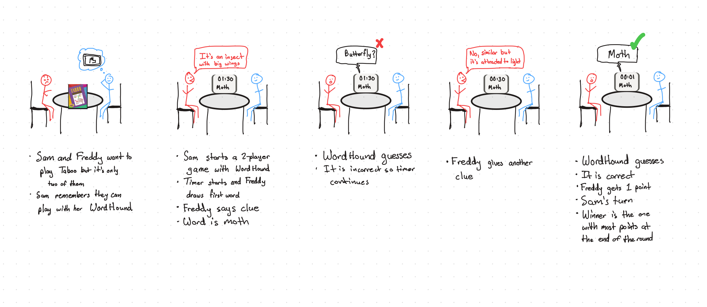
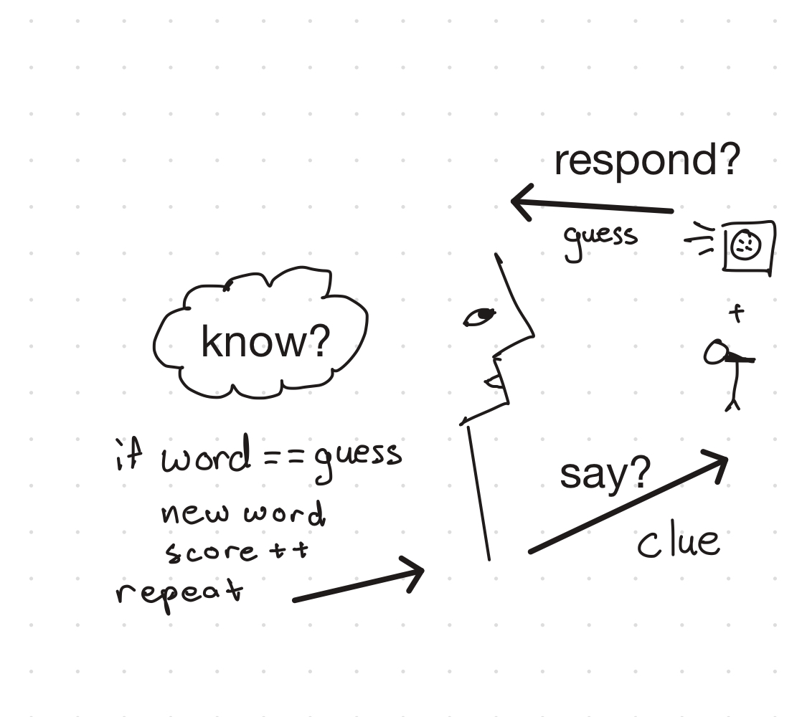
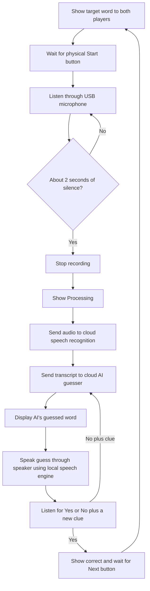

# Chatterboxes

**NAMES OF COLLABORATORS HERE**
Jonathan Tumalle (jrt285)
Ani Hadagali (ah2495)

[](https://www.youtube.com/embed/Q8FWzLMobx0?start=19)

In this lab, we want you to design interaction with a speech-enabled device — something that listens and talks to you. This device can do anything *but* control lights (since we already did that in Lab 1). First, we want you to storyboard what you imagine the conversational interaction to be like. Then you will use wizarding techniques to elicit examples of what people might say, ask, or respond. We then want you to use the examples collected from at least two other people to inform the redesign of the device.

We will focus on **audio** as the main modality for interaction to start; these general techniques can be extended to **video**, **haptics** or other interactive mechanisms in the second part of the Lab.

A note on what you are building with. Speech interfaces are usually taught as two boxes — speech-in, speech-out — and that framing hides the part that actually determines whether an interaction works. Between listening and speaking sits the question of **whose turn it is**: when does the device decide you have finished talking, and how long does it make you wait before it answers? This lab gives you direct control over both, and we will ask you to notice what changes when you move them.

## Prep for Part 1: Get the Latest Content and Pick up Additional Parts

Please check instructions in [prep.md](prep.md) and complete the setup.

### Pick up Web Camera If You Don't Have One

Students who have not already received a web camera will receive their Webcam and at the beginning of lab. If you cannot make it to class this week, please contact the TAs to ensure you get these.

### Get the Latest Content

As always, pull updates from the class Interactive-Lab-Hub to both your Pi and your own GitHub repo.

**\[recommended\]** Option 1: On the Pi, `cd` to your `Interactive-Lab-Hub`, pull the updates from upstream (class lab-hub) and push the updates back to your own GitHub repo. You will need the *personal access token* for this.

```
pi@ixe00:~$ cd Interactive-Lab-Hub
pi@ixe00:~/Interactive-Lab-Hub $ git pull upstream Fall2026
pi@ixe00:~/Interactive-Lab-Hub $ git add .
pi@ixe00:~/Interactive-Lab-Hub $ git commit -m "get lab3 updates"
pi@ixe00:~/Interactive-Lab-Hub $ git push
```

Option 2: On your own GitHub repo, create a pull request to get updates from the class Interactive-Lab-Hub. After you have the latest updates online, go to your Pi, `cd` to your `Interactive-Lab-Hub` and use `git pull`.

---

# Part 1

## Setup

Create and activate a virtual environment for this lab:

```
pi@ixe00:~$ cd Interactive-Lab-Hub/Lab\ 3
pi@ixe00:~/Interactive-Lab-Hub/Lab 3 $ python3 -m venv .venv
pi@ixe00:~/Interactive-Lab-Hub/Lab 3 $ source .venv/bin/activate
(.venv) pi@ixe00:~/Interactive-Lab-Hub/Lab 3 $
```

Install the Python dependencies:

```
(.venv) $ pip install -r requirements.txt
```

This takes a few minutes. If you would like it to take considerably less time, [`uv`](https://docs.astral.sh/uv/) is a drop-in replacement for `pip` that is dramatically faster on the Pi:

```
(.venv) $ pip install uv && uv pip install -r requirements.txt
```

Then run the setup script, which installs the classic speech synthesizers, downloads the voice activity detection model, and pre-fetches a neural voice and a speech recognition model so you are not waiting on downloads during lab:

```
(.venv):~$ cd speech-scripts
(.venv) $ ./setup.sh
```

Check your audio devices before going further. `arecord -l` lists capture devices and `aplay -l` lists playback devices; if your webcam microphone or Bluetooth speaker does not appear, fix that first — every script below assumes the system defaults are the ones you want.

## A. Text to Speech

Your Pi can speak in several quite different ways, and the differences are audible in a way that matters for design. In `speech-scripts/` there are shell scripts for each.

### The classic engines

```
(.venv) $ cd speech-scripts

(.venv) $ sudo apt update
(.venv) $ sudo apt install -y espeak festival festvox-kallpc16k

(.venv) $ ./espeak_demo.sh
(.venv) $ ./festival_demo.sh
```

You can run these `.sh` files by typing `./filename`, and read one with `cat filename`. You can also play audio files directly with `aplay filename` — try `aplay lookdave.wav`.

These are all decades-old technology and they sound like it. `espeak-ng` is a *formant synthesizer*: it generates speech from an acoustic model of the vocal tract, which is why it sounds robotic but also why the whole thing fits in a couple of megabytes and responds instantly. `festival` is *concatenative*: they stitch together recorded fragments of a real speaker, which sounds more human but breaks audibly at the seams.

### Neural TTS with Piper

Note that the Piper command line changed in version 1.x — voices are now downloaded explicitly with `python3 -m piper.download_voices`, and you invoke it as `python3 -m piper`. Tutorials you find online may show the old `echo ... | piper --model ...` form, which no longer works. Browse the [voice samples](https://rhasspy.github.io/piper-samples) and download a different one if you'd like:

```
(.venv) $ python3 -m piper.download_voices en_US-lessac-medium
```

[Piper](https://github.com/OHF-Voice/piper1-gpl) synthesizes speech with a small neural network, runs comfortably on the Pi 5, and sounds markedly better than the above.

```
(.venv) $ ./piper_demo.sh
```

The demo script also shows `--output-raw`, which streams audio to the speaker as it is generated rather than writing a file first. Listen for the difference in how quickly speech begins. In a conversational system this gap is the thing your user experiences as responsiveness.

\*\***Write your own shell file to use your favorite of these TTS engines to have your Pi greet you by name.**\*\*
(This shell file should be saved to your own repo for this lab.)
[link to script](speech-scripts/text_to_speech_a.sh)

\*\***Then answer: Is the same greeting, in these different voices, the same greeting? Describe one concrete way the voice changed what the utterance seemed to mean or who seemed to be speaking.**\*\*

*Answer:* I used three different voices for the script. The voices changed in how formal and inviting they sounded. `en_US-norman-medium` sounds more friendly like an actual greeting. `en_GB-vctk-medium` sounds very monotone and disinterested. `en_GB-southern_english_female-low` was just formal and direct.

## B. Speech to Text

We use [faster-whisper](https://github.com/SYSTRAN/faster-whisper), a reimplementation of OpenAI's Whisper model that runs several times faster on CPU and does not require PyTorch. All processing happens on the Pi; nothing is sent to a server.

```
(.venv) $ python transcribe.py lookdave.wav
```

The transcript is not the interesting output here — the timings are. Run it again with a larger model and compare:

```
(.venv) $ python transcribe.py lookdave.wav --model base.en
(.venv) $ python transcribe.py lookdave.wav --model small.en
#  noted that the first run may take longer because the model is downloaded, and that the HF unauthenticated-request warning is expected and not an error.
```

Available sizes, smallest first: `tiny.en`, `base.en`, `small.en`, `medium.en`. The `.en` variants are English-only and faster than their multilingual counterparts at the same size.

\*\***Record a few seconds of your own speech (`arecord -d 5 -f cd -c 1 -r 16000 test.wav`) and transcribe it with at least two model sizes. Report the real-time factor for each. At what point does the accuracy improvement stop being worth the delay, for a system that has to answer you?**\*\*

The real time factor of the two models I chose:

- small - 1.30x
- tiny - 0.22x

Accuracy improvements stop being worth the delay if the text already captures the words said with tolerance for some grammatical errors. In the example, the output of the `small` was "Hey, this is Jonathan. I hope you're having a great day." The `tiny` transcribed the same audio to "Hey this is Jonathan, I hope you're having a great day." This grammar inaccuracy is fine for me as the reader since I can understand the intention still. If this was to be sent to someone else in a more formal setting, then I may prefer the `small`'s output since I would have less tolerance for grammar mistakes.

\*\***Write your own script that verbally asks for a numerical input (a phone number, zipcode, number of pets) and records the answer the respondent provides.**\*\* Numbers are a good stress test — transcription systems make characteristic errors on digit strings, and you will want to know what they are before you design around them.

Script is [here](speech-scripts/transcribe_numbers.py)

## C. Turn-taking: knowing when someone has stopped talking

Everything so far has worked on fixed audio files. A real conversational device does not get told when to start and stop recording — it has to decide. This is the problem that makes speech interfaces hard, and it is mostly not a speech recognition problem.

We use a **voice activity detector** (VAD) to segment the microphone stream into utterances. `listen.py` runs Silero VAD continuously and hands each detected utterance to faster-whisper:

```
(.venv) $ cd speech-scripts
(.venv) $ python listen.py
```

Speak, pause, and watch it transcribe. Now change the endpointing threshold — the amount of silence the system requires before it decides your turn is over:

```
(.venv) $ python listen.py --min-silence 0.2
(.venv) $ python listen.py --min-silence 1.5
```

\*\***Try both extremes, and something in between. Describe what each one feels like to talk to. Note specifically: at 0.2s, what kinds of normal speech get cut off? At 1.5s, what does the delay make the system seem like?**\*\*

*Answer:* A larger delay makes the system feel like it's trying to actually log what was said and comprehend it, while the smaller delay feels rushed. The smaller delay makes it feel like the model is not understanding, and the text output also showed this behavior. It was as if it was cutting me off like a rude person.

There is no correct value. A system that takes drink orders and a system that listens to someone think out loud want very different thresholds, and the right one depends on what your users are doing with their pauses.

### The complete loop

`echo_bot.py` puts the pieces together: it listens, endpoints, transcribes, and speaks a reply through Piper. The dialogue policy is deliberately trivial — it repeats what you said — so that everything you notice is a property of the timing rather than the content.

```
(.venv) $ python echo_bot.py
```

## D. Storyboard

Storyboard and/or use a Verplank diagram to design a speech-enabled device. (Stuck? Make a device that talks for dogs. If that is too stupid, find an application that is better than that.)

### IDEA: 2 player Taboo (WordHound)

\*\***Post your storyboard and diagram here.**\*\*

Storyboard:



Verplank diagram:



Write out what you imagine the dialogue to be. Use cards, post-its, or whatever method helps you develop alternatives or group responses.

\*\***Please describe and document your process.**\*\*

Your script should include the pauses. Where does your device wait, and for how long? You now know from Part C that this is a parameter you have to choose, not something that happens for free.

#### WordHound dialogue script

WordHound is a two-player Taboo game in which the device guesses the secret word from one player's spoken clues. The clue-giver sees the card; WordHound must not. Each player gets an 2 minute turn as the clue-giver. A correct guess earns the clue-giver one point and advances to the next card. A wrong guess keeps the same card active so the player can add a clue. The player with the most points after both turns wins.

##### Example round [AI Assisted in setting up the script]

**Word on card (Freddy only):** moth<br>
**Taboo words:** insect, wings, butterfly, light

**WordHound:** Freddy, your turn. Your 2 minutes start now. Describe the word without saying the word or the words printed on the card.

*[Pause for Freddy to begin; allow up to 5 seconds. If no speech is detected, prompt once: "I'm listening for your clue."]*

**Freddy:** It comes out at night and flies around a porch lamp.

*[Wait for Freddy to finish. Treat 1.0 second of silence as the end of the clue; if speech resumes before then, keep listening.]*

**WordHound:** Is it a butterfly?

**Freddy:** No, similar, but it's attracted to light.

*[Wait for the end of the reply using the same 1.0-second silence threshold.]*

**WordHound:** Is it a moth?

**Freddy:** Yes!

**WordHound:** Correct! Freddy gets one point. Your score is one. Here's the next word.

*[Brief 1-second pause while WordHound selects the next card, then continue listening.]*

**WordHound:** Here's your next word.

*[Brief 1-second pause for the next card. WordHound listens for Freddy's clue and waits for 1.0 second of silence before guessing.]*

**Freddy:** It flies at night and hangs upside down in a cave.

**WordHound:** Is it a bat?

**Freddy:** Yes!

**WordHound:** Correct! That's two points for Freddy.

*[Timer runs out]*

**WordHound:** Your turn is over. *[Pause 2 seconds while the device switches players.]* Sam, your turn. Your 2 minutes start now. Describe the word on your card without saying the word or the words printed on it.

*[Sam looks at the card. WordHound waits up to 5 seconds for Sam to begin; if no speech is detected, it prompts once: "I'm listening for your clue."]*

**Sam:** You use it to unlock a door. It can be metal, and you might keep it on a ring.

*[WordHound waits for the clue to end, using 1.0 second of silence.]*

**WordHound:** Is it a key?

**Sam:** Yes!

**WordHound:** Correct! Sam gets one point. *[Pause 1 second to select the next card.]* Here's your next word.

**Sam:** You wear it on your wrist and it tells you the time.

*[WordHound waits for 1.0 second of silence.]*

**WordHound:** Is it a watch?

**Sam:** Yes!

**WordHound:** Correct! That's two points. *[Pause 1 second to select the next card.]* Here's your next word.

**Sam:** It is a place where you borrow books.

*[WordHound waits for 1.0 second of silence.]*

**WordHound:** Is it a library?

**Sam:** Yes!

**WordHound:** Correct! That's three points.

*[The 2-minute timer ends.]*

**WordHound:** Time! Sam scored three points this turn. This round ends with Freddy at two points and Sam at three.

*[Skip ahead through the remaining rounds. WordHound keeps score and alternates turns.]*

**WordHound:** Game over! Freddy finished with eight points, and Sam finished with ten. Sam wins!

## E. Acting out the dialogue

Find a partner, and *without sharing the script with your partner* try out the dialogue you've designed, where you (as the device designer) act as the device you are designing. Please record this interaction (for example, using Zoom's record feature).

\*\***Describe if the dialogue seemed different than what you imagined when it was acted out, and how.**\*\*

*Answer:* We described our feedback as part of the video.

[Watch the video here](https://drive.google.com/file/d/1XunK0EcWV18VXaPGtrj4vkQcQwvqhCNR/view?usp=share_link)

---

# Lab 3 Part 2

For Part 2, you will redesign the interaction with the speech-enabled device using the data collected, as well as feedback from part 1.

## Prep for Part 2

1. What are concrete things that could use improvement in the design of your device? For example: wording, timing, anticipation of misunderstandings.
2. What are other modes of interaction *beyond speech* that you might also use to clarify how to interact? In particular: how does someone know when the device is listening, and when it is thinking? You have a screen and an LED.
3. Make a new storyboard, diagram and/or script based on these reflections.
4. (optional) Integrate [input devices](inputs.md) in the system

## Prototype your system

The system should:
* use the Raspberry Pi
* use one or more sensors
* require participants to speak to it

*Document how the system works.*

*Include videos or screencaptures of both the system and the controller.*

### WordHound POC: 2-Player Taboo

The first version is a single-round prototype running on a Raspberry Pi. Both
players see the target word. The clue giver describes it aloud, and the AI
tries to guess the word from the transcript. There are no forbidden words,
or scoring in this POC. After a guess, the player can confirm it or say
"No" followed by their next clue in the same response.



#### First-version components

- **Raspberry Pi app and display:** shows the target word to both players, a
  listening/processing status, and the AI's guess.
- **Physical Start button:** begins capturing the clue.
- **USB microphone:** captures the clue giver's speech.
- **Pause detection:** stops recording after about two seconds of silence.
- **Cloud speech recognition:** transcribes the recorded audio.
- **Cloud AI guesser:** receives only the transcript and returns a guessed
  word; it is not given the target word.
- **Speaker and local speech engine:** say the AI's guess aloud.
- **Feedback listener:** treats a spoken "yes" as completion, or uses the
  clue after a spoken "no" for the next guess without an extra turn.
- **Round controller:** coordinates the prompt, recording, processing, and
  result steps.

## Test the system

Try to get at least two people to interact with your system. (Ideally, you would inform them that there is a wizard *after* the interaction, but we recognize that can be hard.)

Answer the following:

### What worked well about the system and what didn't?
\*\**your answer here*\*\*

### What worked well about the controller and what didn't?
\*\**your answer here*\*\*

### What lessons can you take away from the WoZ interactions for designing a more autonomous version of the system?
\*\**your answer here*\*\*

### How could you use your system to create a dataset of interaction? What other sensing modalities would make sense to capture?
\*\**your answer here*\*\*

<details>
  <summary><strong>Submission Cleanup Reminder (Click to Expand)</strong></summary>

  **Before submitting your README.md:**
  - This readme.md file has a lot of extra text for guidance.
  - Remove all instructional text and example prompts from this file.
  - You may either delete these sections or use the toggle/hide feature in VS Code to collapse them for a cleaner look.
  - Your final submission should be neat, focused on your own work, and easy to read for grading.
</details>
